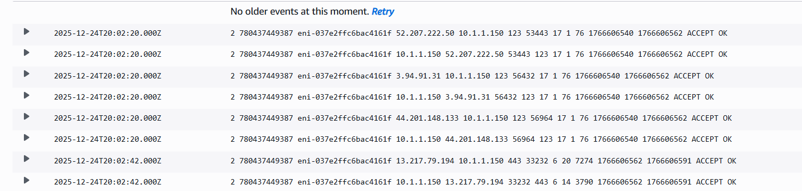

# 🧠 Lab: Creating AWS VPC Flow Logs and Generating Traffic + Introduction to Creating AWS VPC Flow Logs

---

## 🎯 Goal
Deploy a basic Amazon EKS cluster (`whiz`) and verify connectivity from AWS CloudShell using `kubectl`.  
Understand EKS control plane components, configure kubectl, and validate cluster services.

---

## ⚙️ Steps Summary

## 🧩 Key Learnings
VPC Flow Logs allow you to capture information about the IP traffic going to and from your VPC, including details such as source and destination IP addresses, ports, protocols, and packet counts.
configuring its components such as subnets and internet gateways, and implementing VPC Flow Logs for monitoring network traffic within the VPC

## 🧰 Troubleshooting Notes

## 🏁 Resume Line
